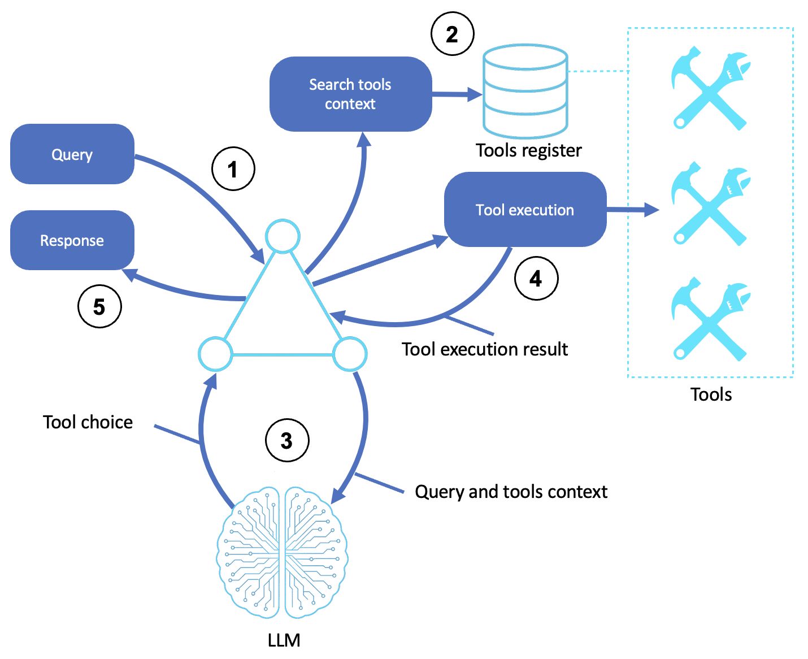

# Tool-Based Agents for Calling Functions

Agents that invoke external functions to act beyond pure reasoning: calculations, real-time data, database queries, and external systems.

This sample covers building tool-enabled agents with the [Strands Agents SDK](https://strandsagents.com/) and is based off of the [AWS Prescriptive Guidance - Tool-Based Agents pattern](https://docs.aws.amazon.com/prescriptive-guidance/latest/agentic-ai-patterns/tool-based-agents-for-calling-functions.html).

## Table of Contents

- [Quick Start](#quick-start)
- [Tool Agent](#tool-agent)
  - [How It Works](#how-it-works)
  - [Creating Tools with the @tool Decorator](#creating-tools-with-the-tool-decorator)
  - [Attaching Tools to an Agent](#attaching-tools-to-an-agent)
  - [Multiple Tools](#multiple-tools)
  - [Tool Context](#tool-context)
- [AWS Implementation Patterns](#aws-implementation-patterns)
- [Reference](#reference)


## Quick Start

**Prerequisites:**
- Python 3.10+
- An AWS account with Amazon Bedrock access
- AWS credentials configured (`aws configure`) with permission to invoke models on Bedrock

```bash
# Create and activate virtual environment
python3 -m venv venv
source venv/bin/activate  # On Windows: venv\Scripts\activate

# Install dependencies
pip install -r requirements.txt

# Point the sample at your AWS profile and region (loaded by shared/model.py)
cp .env.example .env
# Edit .env: set AWS_PROFILE and AWS_REGION. Optionally pin a model with STRANDS_MODEL_ID.

# Run the tool agent
python tool_agent.py
```

**Try these exercises:**
1. **Add a tool.** Write a new `@tool` function (e.g., a unit converter) and confirm the agent calls it when relevant.
2. **Tune a docstring.** Make a tool's docstring vague, then specific, and observe how tool selection changes.
3. **Force a fallback.** Ask a general-knowledge question and confirm the agent answers directly without calling a tool.
4. **Chain two tools.** Ask a question that needs more than one tool (e.g., "What's 15% of 240, and what's the weather in Tokyo?") and watch the agent call both.

---

## [Tool Agent](tool_agent.py)

### How It Works

1. **Receives query**: The agent receives a natural-language query or task
2. **Searches for tools**: The agent checks its registered tools, schemas, and capabilities
3. **Selects and invokes tools**: The LLM picks the most relevant tool, constructs the input arguments, and returns a structured function call
4. **Runs the chosen tool**: The tool runner executes the function and returns the result (an API output, database value, or computation)
5. **Returns a response**: The LLM incorporates the tool result into its reasoning and returns a natural-language response

[Strands Agents](https://strandsagents.com/) turns an ordinary Python function into an agent tool with the `@tool` decorator.



### Creating Tools with the @tool Decorator

The decorator reads your function's docstring and type hints to build the tool specification the LLM sees:

```python
from strands import tool

@tool
def calculator(operation: str, a: float, b: float) -> str:
    """Perform basic arithmetic operations.

    Args:
        operation: The operation to perform (add, subtract, multiply, divide)
        a: First number
        b: Second number
    """
    operations = {
        "add": a + b,
        "subtract": a - b,
        "multiply": a * b,
        "divide": a / b if b != 0 else "Error: Division by zero"
    }
    result = operations.get(operation.lower(), "Unknown operation")
    return f"{a} {operation} {b} = {result}"
```

What the decorator extracts:
- The **first paragraph of the docstring** becomes the tool's description
- The **`Args` section** provides per-parameter descriptions
- [**Type hints**](https://docs.python.org/3/glossary.html#term-type-hint) define parameter types
- The **return value** is formatted as the tool's text response

The docstring isn't just documentation, it's the instruction the model uses to decide *when* to call the tool. See [Custom tools](https://strandsagents.com/docs/user-guide/sdk/tools/custom-tools/) in the Strands docs for the full specification.

### Attaching Tools to an Agent

Pass tools as a list when creating the agent. The model decides when to use them:

```python
from strands import Agent

agent = Agent(
    system_prompt="""You are a helpful assistant with access to tools.
    Use the calculator for math operations, get_weather for weather queries,
    and search_knowledge for information lookups. Always use the appropriate
    tool when the user's request matches its capabilities.""",
    tools=[calculator, get_weather, search_knowledge],
    callback_handler=None
)
```

### Multiple Tools

`tool_agent.py` registers three tools: `calculator`, `get_weather`, and `search_knowledge`. You don't write routing logic; the LLM matches each query to the right tool. A query like "What's the weather in Tokyo?" triggers `get_weather`, while "What's the capital of France?" is answered from the model's own knowledge.

### Tool Context

Tools can opt into the execution context to reach agent state, the conversation, or invocation metadata:

```python
from strands import tool, ToolContext

@tool(context=True)
def get_agent_info(tool_context: ToolContext) -> str:
    """Get information about the current agent."""
    return f"Agent name: {tool_context.agent.name}"
```

---

## AWS Implementation Patterns

| Pattern | Description | Reference |
|---------|-------------|-----------|
| Programmatic Tool Calling on Bedrock | Implement tool calling where LLMs invoke multiple tools without full round-trips, improving performance | [Implementing programmatic tool calling on Amazon Bedrock](https://aws.amazon.com/blogs/machine-learning/implementing-programmatic-tool-calling-on-amazon-bedrock/) |
| Model Distillation for Function Calling | Improve tool-calling accuracy while reducing cost and latency using Amazon Bedrock Model Distillation | [Amazon Bedrock Model Distillation: Boost function calling accuracy while reducing cost and latency](https://aws.amazon.com/blogs/machine-learning/amazon-bedrock-model-distillation-boost-function-calling-accuracy-while-reducing-cost-and-latency/) |
| Strands @tool Decorator Patterns | Build tool-enabled agents using the Strands SDK model-driven approach with the @tool decorator | [Strands Agents SDK: A technical deep dive into agent architectures and observability](https://aws.amazon.com/blogs/machine-learning/strands-agents-sdk-a-technical-deep-dive-into-agent-architectures-and-observability/) |
| Structured Outputs with Tool Use | Enforce schema-compliant responses from tool-calling agents using strict structured outputs | [Structured outputs on Amazon Bedrock: Schema-compliant AI responses](https://aws.amazon.com/blogs/machine-learning/structured-outputs-on-amazon-bedrock-schema-compliant-ai-responses/) |

## Reference

- [AWS Prescriptive Guidance - Tool-based agents for calling functions](https://docs.aws.amazon.com/prescriptive-guidance/latest/agentic-ai-patterns/tool-based-agents-for-calling-functions.html)
- [Strands Agents Documentation](https://strandsagents.com/)
- [Amazon Bedrock User Guide](https://docs.aws.amazon.com/bedrock/latest/userguide/what-is-bedrock.html)

### The series

This sample is one of eleven, one per pattern in the [AWS Prescriptive Guidance on agentic AI patterns](https://docs.aws.amazon.com/prescriptive-guidance/latest/agentic-ai-patterns/). Each has a hands-on sample repository.

| # | Pattern | Sample |
|---|---|---|
| 01 | Basic Reasoning Agents | [sample-basic-reasoning-agents](https://github.com/aws-samples/sample-basic-reasoning-agents) |
| 02 | Tool-Based Agents (Functions) | this repository |
| 03 | Tool-Based Agents (Servers) | [sample-tool-based-agents-servers](https://github.com/aws-samples/sample-tool-based-agents-servers) |
| 04 | Computer-Use Agents | [sample-computer-use-agents](https://github.com/aws-samples/sample-computer-use-agents) |
| 05 | Coding Agents | [sample-coding-agents](https://github.com/aws-samples/sample-coding-agents) |
| 06 | Speech and Voice Agents | [sample-speech-voice-agents](https://github.com/aws-samples/sample-speech-voice-agents) |
| 07 | Workflow Orchestration Agents | [sample-workflow-orchestration-agent](https://github.com/aws-samples/sample-workflow-orchestration-agent) |
| 08 | Memory-Augmented Agents | [sample-memory-augmented-agents](https://github.com/aws-samples/sample-memory-augmented-agents) |
| 09 | Simulation and Test-Bed Agents | [sample-simulation-testbed-agents](https://github.com/aws-samples/sample-simulation-testbed-agents) |
| 10 | Observer and Monitoring Agents | [sample-observer-monitoring-agents](https://github.com/aws-samples/sample-observer-monitoring-agents) |
| 11 | Multi-Agent Collaboration | [sample-multi-agent-collaboration](https://github.com/aws-samples/sample-multi-agent-collaboration) |

## Security

See [CONTRIBUTING](CONTRIBUTING.md#security-issue-notifications) for more information.

## License

This library is licensed under the MIT-0 License. See the LICENSE file.
